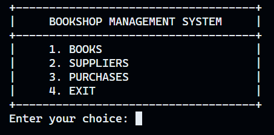
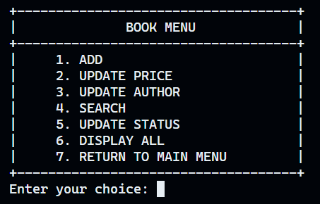
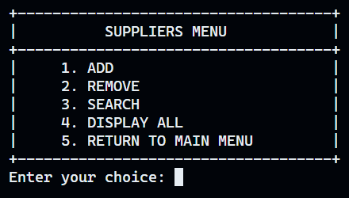

# Bookshop Management System

## How to use
```bash
git clone https://github.com/fansuregrin/bookshop-management-system.git bookshop-management-system
cd bookshop-management-system
mkdir build
cd build
cmake ..
cmake --build .
./bookshop-management-system
```

## ScreenShots
- main menu



- books menu



- suppliers menu



- purchases menu


## Acknowledgement
- [Bookshop-Management-System-CPP-Project](https://github.com/aryan-dragun/Bookshop-Management-System-CPP-Project)
- [How to hide input via CLI with C++](https://terminalroot.com/how-to-hide-input-via-cli-with-cpp/)
- [Taking password as input in C++](https://www.geeksforgeeks.org/taking-password-as-input-in-cpp/)